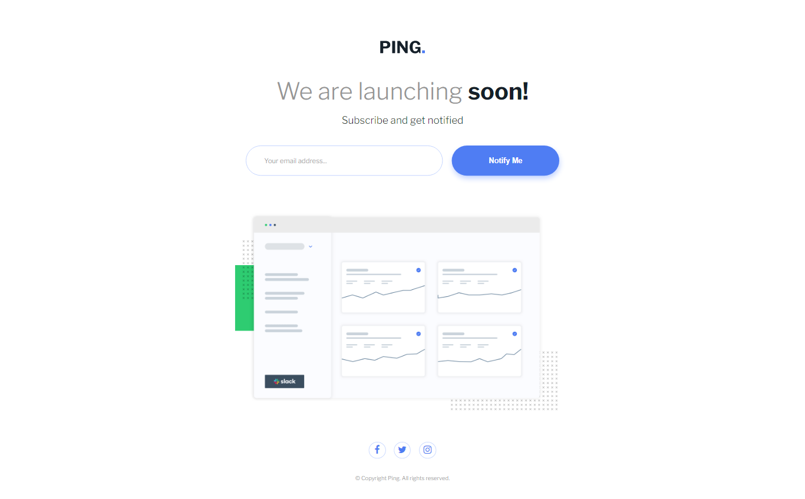

# Frontend Mentor - Ping coming soon page solution

This is a solution to the [Ping coming soon page challenge on Frontend Mentor](https://www.frontendmentor.io/challenges/ping-single-column-coming-soon-page-5cadd051fec04111f7b848da). Frontend Mentor challenges help you improve your coding skills by building realistic projects. 

## Table of contents

- [Overview](#overview)
  - [The challenge](#the-challenge)
  - [Screenshot](#screenshot)
  - [Links](#links)
- [Author](#author)

## Overview

### The challenge

Users should be able to:

- See hover states for interactive elements
- See the error messages

### Screenshot

### Links

- Solution URL: [Add solution URL here](https://github.com/victorsonet/victorsonet.github.io)
- Live Site URL: [Add live site URL here](https://victorsonet.github.io/)

## My process

### Built with

- Semantic HTML5 markup
- CSS custom properties
- Flexbox
- JS

## Author

- Website - [Viktor Kovács](https://victorsonet.github.io/)
- Frontend Mentor - [@victorsonet](https://www.frontendmentor.io/profile/victorsonet)
- Twitter - [@GMLvictorsoN](https://twitter.com/GMLvictorsoN)
